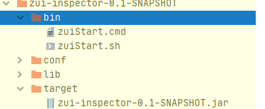
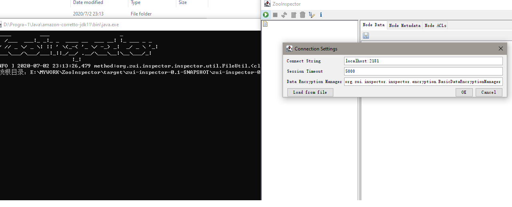

# ZooInspector

#### 介绍
Zookeeper 可视化客户端,基于Apache的 ZooInspector 进行修改。

- 依赖jar 升级 
- 基于Maven 工程构建
- 编写 MAVEN 打包方式

<pre>
    - bin                   ->启动脚本
    - conf                  -> 系统配置文件 
        - config            -> UI配置
        - icons             -> 图标
    - lib                   ->三方库
    - ZooInspector          -> 系统JAR
    
</pre>

#### 编译

- mvn package

#### 使用说明
1.  因为脚本原因，windows 支支持JDK 8 （欢迎提交改进 ） 可以设置 JAVA_HOME8 配置JDK8 来兼容
2.  执行 zuiStart.sh/cmd 启动

#### 参与贡献

1.  Fork 本仓库
2.  新建 Feat_xxx 分支
3.  提交代码
4.  新建 Pull Request
